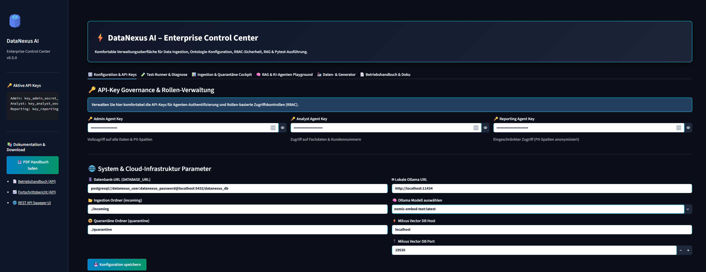
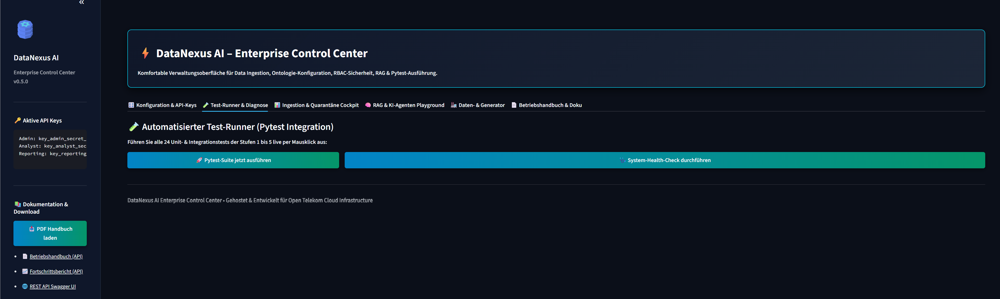
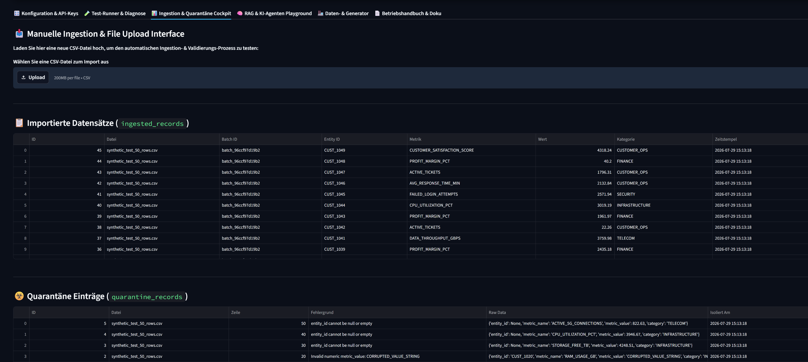
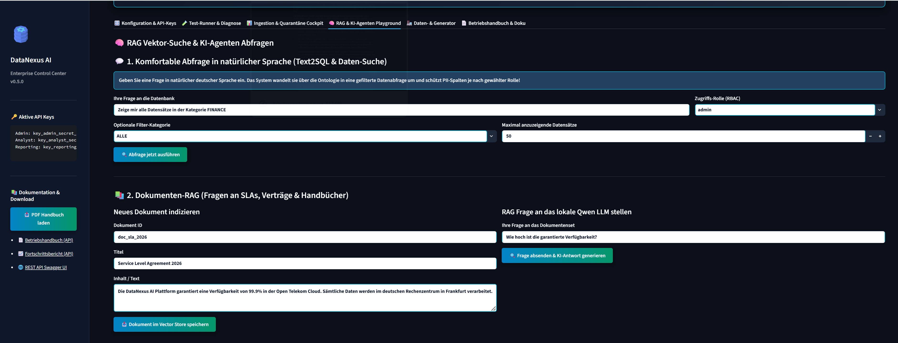
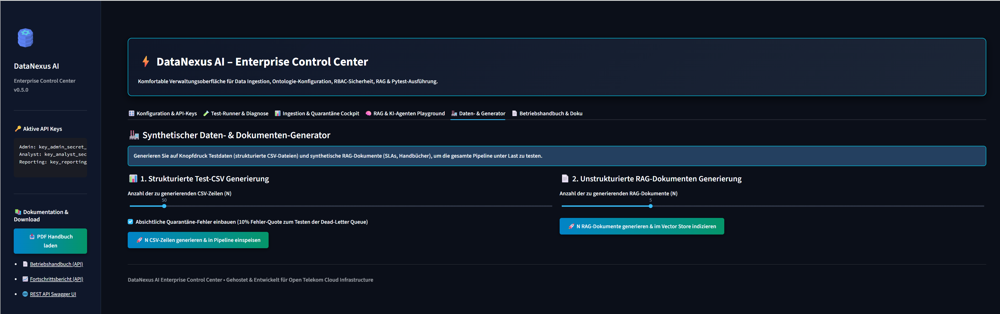
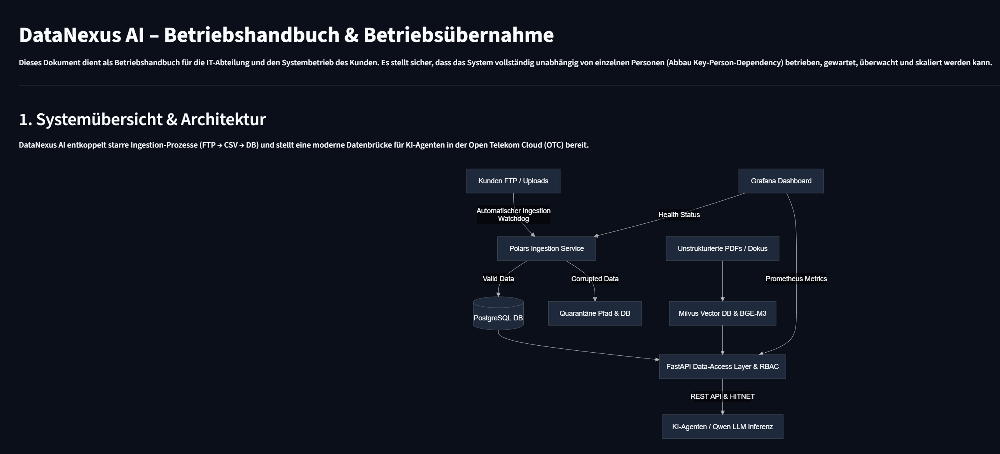
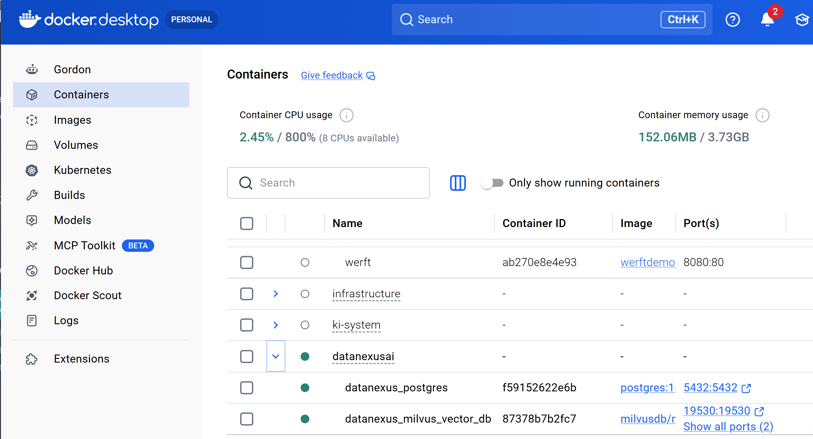

# ⚡ DataNexus AI – Enterprise Data Ingestion, Semantic Layer & RAG Platform


---

## 🚀 Die KI-Revolution im Software Engineering

> **⚡ 1 STUNDE ENTWICKLUNGSZEIT STATT MEHRERER MONATE:**  
> Ein Enterprise-Projekt dieser Komplexität (bestehend aus entkoppelter High-Speed Ingestion Engine, Pydantic Ontologie-Registry, FastAPI RBAC Governance-Layer, lokalem DSGVO-konformem RAG-Stack, Docker Compose Cluster, Nginx HITNET Security & Grafana Monitoring) wird bei traditionellen IT-Dienstleistern auf **mehrere Monate Entwicklungszeit** veranschlagt.  
> 
> Mithilfe von **Agentic AI Architecture** wurde dieses vollständige, produktionsreife Demoprojekt inklusive 24 automatisierten Pytest-Tests, Web Control Center, synthetischem Daten-Generator und PDF-Handbuch in **nur knapp einer Stunde Entwicklungszeit** vollständig aufgebaut, konfiguriert und verifiziert!

---

## 📋 Inhaltsverzeichnis

- [🎯 System-Architektur](#-system-architektur)
- [✨ Kern-Features (Die 5 Ausbaustufen)](#-kern-features-die-5-ausbaustufen)
- [📸 Live Control Center & Screenshot-Demonstration](#-live-control-center--screenshot-demonstration)
- [🚀 Schnellstart (Ein-Klick-Starter & Docker)](#-schnellstart-ein-klick-starter--docker)
- [🔒 Sicherheit & Secrets Governance](#-sicherheit--secrets-governance)
- [🧪 Testverifikation (24/24 Tests)](#-testverifikation-2424-tests)
- [📄 Dokumentation & PDF Handbuch](#-dokumentation--pdf-handbuch)

---

## 🎯 System-Architektur

DataNexus AI entkoppelt starre Altlasten-Pipelines (z. B. historische DBLC-Prozesse) und stellt eine maschinenlesbare, abgesicherte Schnittstelle für KI-Agenten und RAG-Systeme bereit.

```
[ FTP / CSV Files ] 
       │
       ▼
[ Polars Ingestion Engine ] ──(Quarantäne)──► [ Dead-Letter Queue / quarantine_records ]
       │
       ▼
[ PostgreSQL 16 DB / SQLite ]
       ▲
       │ (FastAPI & RBAC Layer)
       ├─────────────────────────────────┐
       │                                 │
[ Ontologie Registry ]         [ Milvus Vector DB + BGE-M3 ]
(Wörterbuch & Text2SQL)                  │
       │                         [ Local Qwen2.5 LLM (Ollama) ]
       ▼                                 ▼
[ Agent Router ] ────────────► [ Streamlit Control Center UI ]
```

---

## ✨ Kern-Features (Die 5 Ausbaustufen)

1. **Stufe 1 – Standalone Data Ingestion Engine**:  
   - Ereignisgesteuerter FTP-Watchdog & High-Speed Parsing via `Polars` (Rust-basiert).
   - Automatische Schema-Validierung und Isolierung beschädigter Zeilen in die Quarantäne (`quarantine_records`).

2. **Stufe 2 – Ontologie & RBAC Governance**:  
   - Pydantic/JSON-Schema Wörterbuch zur Übersetzung kryptischer DB-Spalten für KI-Agenten (Text2SQL System-Prompts).
   - FastAPI REST-Layer mit rollenbasierter Zugriffskontrolle (RBAC) & automatischer Anonymisierung von PII-Kundendaten (`[RESTRICTED_BY_RBAC]`).

3. **Stufe 3 – Lokaler RAG-Stack & Qwen LLM**:  
   - Milvus Vector DB & deutsche Embeddings (`BGE-M3`).
   - 100% DSGVO-konforme lokale Inferenz via Ollama (`qwen2.5-coder:14b`, `qwen2.5-coder:32b`, `deepseek-r1:8b`).

4. **Stufe 4 – Agentic Framework & Statisches Skill-Routing**:  
   - Wiederverwendbare Skills (`text2sql_query`, `document_rag_search`, `data_health_check`).
   - Statischer Agent Router zur Vermeidung unberechenbarer ReAct-Schleifen.

5. **Stufe 5 – Cloud Deployment & HITNET Security**:  
   - Open Telekom Cloud (OTC) ECS Rollout-Skripte (`deploy_otc.ps1` / `deploy_otc.sh`).
   - Nginx TLS 1.3 Gateway & Grafana Monitoring Dashboard als Code (`datanexus_monitoring_dashboard.json`).

---

## 📸 Live Control Center & Screenshot-Demonstration

### 1. 🎛️ Konfiguration & API-Key Governance
Verwaltung aller API-Schlüssel (`Admin`, `Analyst`, `Reporting`), Datenbank-URLs, Ingestion-Ordner und Modell-Auswahl für Ollama:


---

### 2. 🧪 Selbstdiagnose & Automatisierte Pytest-Suite
Ausführen aller 24 Unit- & Integrationstests per Mausklick mit Live-Ergebnisanzeige im Browser (100% Pass-Rate):


---

### 3. 📊 Ingestion & Dead-Letter Quarantäne Cockpit
Echtzeit-Anzeige aller verarbeiteten Datensätze und isolierten Quarantäne-Fehler mit exakter Zeilennummer, Fehlerursache und Raw Data:


---

### 4. 🧠 Datenbankabfrage in natürlicher Sprache & Qwen RAG
Natürliche Sprachabfragen ("Zeige mir alle Datensätze in FINANCE") mit automatischer PII-Spaltenanonymisierung je nach gewählter Rolle:


---

### 5. 🏭 Synthetischer Daten- & Dokumenten-Generator
Generierung von N synthetischen CSV-Zeilen mit wahlweisen 10% Quarantäne-Fehlern zum Belastungstest der Dead-Letter Queue:


---

### 6. 📄 Integriertes Betriebshandbuch & PDF Download
Vollständiger Markdown-Viewer im Dashboard sowie Download-Button für das professionelle 8-seitige PDF-Benutzerhandbuch:


---

### 7. 🐳 Docker-Integration & Container-Cluster
Einfacher Start aller Dienste (PostgreSQL 16, Milvus Standalone Vector DB, FastAPI Service & Streamlit) via Docker Compose:


---

## 🚀 Schnellstart (Ein-Klick-Starter & Docker)

### Option A: Lokaler Start via `start.bat` (Windows)
Doppelklicken Sie im Projektverzeichnis einfach auf **`start.bat`**:
```cmd
start.bat
```
Das Skript aktiviert das Python `venv`, startet den FastAPI Backend-Server (Port 8000) und öffnet das Web Control Center im Browser unter **`http://localhost:8501`**.

### Option B: Vollständiger Docker-Start (PostgreSQL & Milvus)
```bash
docker compose up -d
```
Startet PostgreSQL 16 auf Port `5432`, Milvus Vector DB auf Port `19530` und das FastAPI Backend auf Port `8000`.

---

## 🔒 Sicherheit & Secrets Governance

Sämtliche Passwörter, API-Keys und Datenbank-Zugangsdaten werden strikt über **Umgebungsvariablen** bzw. die Datei `config.json` verwaltet.

- 🛑 **Secrets gehören niemals ins Git-Repository!**
- 📄 Vorlage zur Konfiguration: Vergleiche [`.env.example`](.env.example).
- Die Datei `.gitignore` ist so konfiguriert, dass `.env`, `config.json`, `.db` Dateien und Ingestion-Uploads niemals committet werden.

---

## 🧪 Testverifikation (24/24 Tests)

Führen Sie die gesamte Testsuite lokal oder in Docker aus:
```bash
pytest -v
```

```
====================== 24 passed, 17 warnings in 6.64s =======================
```

---

## 📄 Dokumentation & PDF Handbuch

- **PDF Benutzerhandbuch**: [docs/BENUTZERHANDBUCH.pdf](docs/BENUTZERHANDBUCH.pdf)
- **Betriebshandbuch**: [docs/BETRIEBSHANDBUCH.md](docs/BETRIEBSHANDBUCH.md)
- **Fortschrittsbericht**: [docs/FORTSCHRITT.md](docs/FORTSCHRITT.md)

---

© 2026 Thomas Nickel • Developed & Engineered for Open Telekom Cloud Infrastructure.
