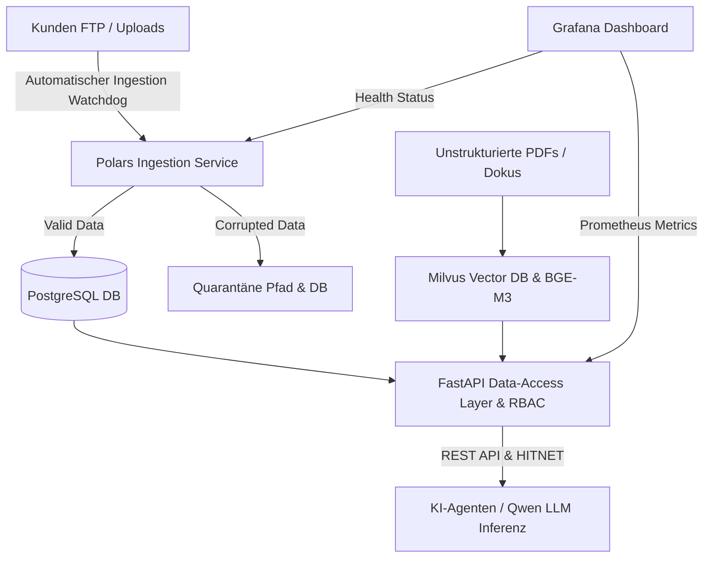

# DataNexus AI – Betriebshandbuch & Betriebsübernahme

Dieses Dokument dient als **Betriebshandbuch** für die IT-Abteilung und den Systembetrieb des Kunden. Es stellt sicher, dass das System **vollständig unabhängig von einzelnen Personen (Abbau Key-Person-Dependency)** betrieben, gewartet, überwacht und skaliert werden kann.

---

## 1. Systemübersicht & Architektur

DataNexus AI entkoppelt starre Ingestion-Prozesse (FTP &rarr; CSV &rarr; DB) und stellt eine moderne Datenbrücke für KI-Agenten in der **Open Telekom Cloud (OTC)** bereit.



---

## 2. Lokaler Start & Containerized Deployment (Docker Compose)

### 2.1 Lokaler Start (Entwicklungs- & Testlabor)
Um die gesamte Plattform lokal auf einem Entwickler-Laptop auszuführen:

```bash
# 1. Repository klonen & in Verzeichnis wechseln
cd DataNexusAI

# 2. Virtual Environment aktivieren & Tests ausführen
.\venv\Scripts\activate
python -m pytest -v

# 3. Docker Container Umgebung starten (PostgreSQL, Milvus, API Service)
docker compose up -d --build
```

### 2.2 Open Telekom Cloud (OTC) Rollout
Der Rollout auf die Open Telekom Cloud Elastic Cloud Server (ECS) erfolgt automatisiert per Skript:

* **Windows (PowerShell)**:
  ```powershell
  .\deploy\deploy_otc.ps1 -OtcHost "otc-ecs-instance.telekom.de" -User "ubuntu" -KeyPath "$HOME\.ssh\otc_key"
  ```
* **Linux / Mac (Bash)**:
  ```bash
  ./deploy/deploy_otc.sh otc-ecs-instance.telekom.de ubuntu ~/.ssh/otc_key
  ```

---

## 3. Sicherheitskonzept & HITNET Integration

* **Nginx Reverse Proxy (`deploy/nginx.conf`)**:
  * Sämtlicher Datenverkehr wird über TLS 1.3 / HTTPS verschlüsselt.
  * **IP-Whitelisting**: Nur Anfragen aus dem Kunden-Subnetz (`10.0.0.0/8` und `192.168.1.0/24`) werden durchgelassen. Alle anderen IPs erhalten ein HTTP 403 Forbidden.
  * **Rate Limiting**: Maximal 30 Anfragen/Sekunde pro Client-IP.

* **Feingranulere Zugriffskontrolle (RBAC)**:
  * KI-Agenten authentifizieren sich per API-Key (`X-API-Key`).
  * Rollen (`admin`, `analyst`, `reporting`) steuern den Datenzugriff. Sensible Spalten (z. B. Kundennummern) werden für eingeschränkte Rollen automatisch maskiert (`[RESTRICTED_BY_RBAC]`).

---

## 4. Quarantäne-Handling & Fehlerbehebung

Trifft eine beschädigte CSV-Datei oder eine Zeile mit ungültigen Datentypen ein:
1. Die fehlerfreie Datenzeilen werden importiert.
2. Fehlerhafte Zeilen wandern in die Tabelle `quarantine_records` inklusive exakter Fehlerursache.
3. Komplett defekte Dateien werden in den Ordner `quarantine/` verschoben und mit einer `.reason.txt` Datei versehen.

**Quarantäne prüfen**:
```bash
# REST API Abfrage
curl -H "X-API-Key: key_admin_secret_123" http://localhost:8000/api/v1/agent/execute -X POST -H "Content-Type: application/json" -d '{"skill_name": "data_health_check"}'
```

---

## 5. Grafana Monitoring Import

Das Überwachungs-Dashboard steht als **Dashboard as Code** bereit:
1. Grafana im Browser öffnen (`http://otc-ecs-instance:3000`).
2. Menü: **Dashboards &rarr; Import**.
3. Die Datei [`deploy/grafana/datanexus_monitoring_dashboard.json`](file:///d:/AntiGravitySoftware/GitWorkspace/DataNexusAI/deploy/grafana/datanexus_monitoring_dashboard.json) hochladen.
4. Fertig! Sie sehen Ingestion-Durchsatz, Quarantäne-Quote, Agenten-Latenzen und Server Health Status in Echtzeit.

---

## 6. Backup & Disaster Recovery

* **PostgreSQL Datenbank Backup**:
  ```bash
  docker exec -t datanexus_postgres pg_dump -U datanexus_user datanexus_db > datanexus_backup_$(date +%Y%m%d).sql
  ```
* **PostgreSQL Wiederherstellung**:
  ```bash
  cat datanexus_backup_20260729.sql | docker exec -i datanexus_postgres psql -U datanexus_user -d datanexus_db
  ```
