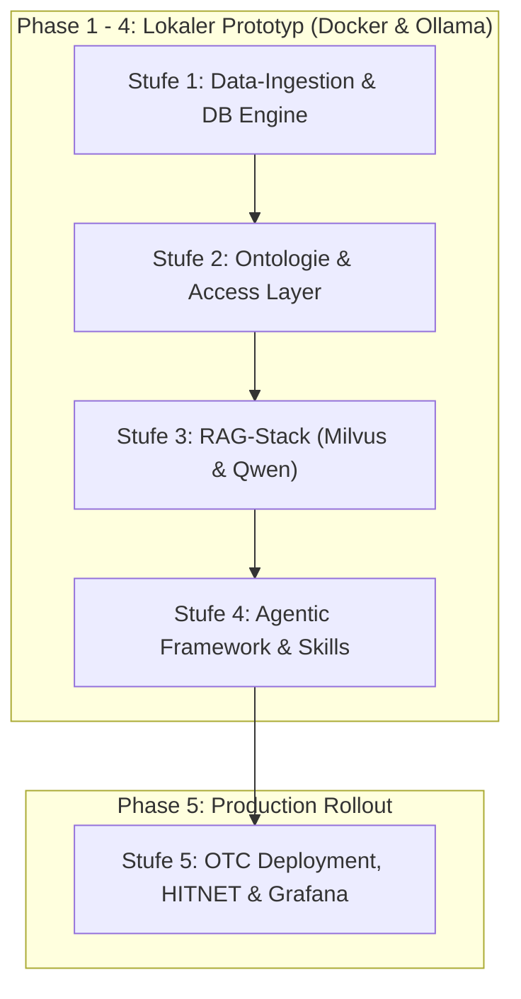

# DataNexus AI – Mehrstufen-Umsetzungskonzept & Projekt-Roadmap

Dieses Dokument beschreibt die Schritt-für-Schritt-Strategie zur Entwicklung, Absicherung und Bereitstellung von **DataNexus AI**. 

Das Vorgehensmodell ist in **5 logische Phasen (Stufen)** gegliedert. Es setzt auf **lokales Prototyping in Docker**, um Entwicklungsrisiken zu minimieren und rasch vorzeigbare Ergebnisse zu liefern, bevor die finale Ausrollung in der **Open Telekom Cloud (OTC)** erfolgt.

---

## 1. Übersicht des Stufenmodells



---

## 2. Detaillierter Stufenplan

### Stufe 1: Entkoppelte Data-Ingestion Pipeline & Basis-Setup
**Fokus**: Eigenständiger Datenimport ohne Abhängigkeiten zum Altsystem (DBLC).

* **Arbeitspakete**:
  1. **Projekt-Setup**: Erstellung der Repository-Struktur, Docker-Befehle und virtuellen Entwicklungs-Umgebung.
  2. **FTP-Watchdog**: Ingestion-Service zur Überwachung eingehender FTP/Ordner-Dateien.
  3. **CSV-Processing Engine**: Hochperformantes Parsing & Typisierung von CSV-Dateien (Polars / Pandas / SQLAlchemy).
  4. **Lokale Datenbank**: Bereitstellung einer PostgreSQL-Datenbank im Docker-Container inklusive Schema-Migrationen.
  5. **Logging & Quarantäne**: Behebung von Parsing-Fehlern, Verschieben fehlerhafter Datensätze in Quarantäne-Pfade.
* **Ergebnis / Deliverables**:
  * Standalone Python-Ingestion-Service.
  * `docker-compose.yml` für FTP, Ingestion-Worker und PostgreSQL.
  * Automatisierte Test-Suite für Datenimports.

---

### Stufe 2: Ontologie, Semantik-Schicht & Data-Access-Layer
**Fokus**: Maschinenlesbare Datenbeschreibung für LLMs und abgesicherter Datenzugriff.

* **Arbeitspakete**:
  1. **Schema-Ontologie**: Definition strukturierter Metadaten (Pydantic / JSON-Schema) zur Beschreibung aller Tabellen, Spalten und Relationen.
  2. **Data-Access API (FastAPI)**: Entwurf einer REST-API als Abstraktionsschicht zwischen Datenbank und KI-Agenten.
  3. **Access Control (RBAC)**: Implementierung von Token-basierter Rechteverwaltung. Agenten erhalten nur Lesezugriff auf explizit freigegebene Schemas/Spalten.
  4. **Metadaten-Endpunkte**: API-Endpunkte für Agenten zur dynamischen Abfrage von Tabellenschemata und Spaltensemantik.
* **Ergebnis / Deliverables**:
  * FastAPI Service mit OpenAPI/Swagger-Dokumentation.
  * Reusable Schema Registry & RBAC-Rechtesystem.

---

### Stufe 3: RAG-Stack & Vektor-DB Integration (Milvus & Qwen)
**Fokus**: Leistungsfähiges Information Retrieval für unstrukturierte & semantische Daten.

* **Arbeitspakete**:
  1. **Milvus Setup**: Einbindung der Milvus Vektor-DB in die lokale Docker-Umgebung.
  2. **German Embeddings**: Integration eines spezialisierten deutschen Embedding-Modells (z. B. `bge-m3` oder `gbert`).
  3. **Chunking-Pipeline**: Entwicklung intelligenter Strategien für Dokumenten-Chunking und Metadaten-Anreicherung.
  4. **Lokale Qwen-Inferenz**: Einbindung des lokalen LLM (Qwen2.5-Coder / Qwen2.5-Instruct via Ollama oder vLLM).
  5. **Hybrid-Search**: Kombinierte Abfrage von Vektorsuche (Milvus) und strukturierter Datenbanksuche (PostgreSQL).
* **Ergebnis / Deliverables**:
  * Vollfunktionsfähiger RAG-Service (Vektorsuche + Lokales LLM).
  * Milvus Collections & Ingestion-Skripte für Vektordaten.

---

### Stufe 4: Agentic Framework & Skill-basiertes Routing
**Fokus**: Standardisierte, vorhersagbare KI-Agenten mit statischen Routen.

* **Arbeitspakete**:
  1. **Skill-basiertes Refactoring**: Umstellung des Agenten-Frameworks von dynamischem Routing auf definierte, statische Pfade ("Skills").
  2. **SQL- & Vektor-Tools**: Registrierung modularer Agenten-Werkzeuge (Text-to-SQL Executor, Vector Search Tool, Schema Inspector).
  3. **Standardisierung**: Erstellung wiederverwendbarer Agenten-Klassen (z. B. `DataAnalysisAgent`, `ReportGeneratorAgent`).
  4. **Automatisierte Health-Checks**: Implementierung von Synthetic-Monitoring-Prompts und Pipeline-Health-Checks.
* **Ergebnis / Deliverables**:
  * Modulares Agentic Framework mit klar definierten Routen.
  * Health-Check Service & Monitoring-Endpunkte für Agenten-Status.

---

### Stufe 5: Open Telekom Cloud Deployment, HITNET & Grafana
**Fokus**: Sicherer Produktivbetrieb in der OTC-Cloud, Härtung & Übergabe.

* **Arbeitspakete**:
  1. **OTC-Architekturentscheidung**: Finale Gegenüberstellung und Auswahl von DBaaS vs. Self-Hosted PostgreSQL/ClickHouse auf OTC ECS.
  2. **Infrastructure-as-Code**: Skripte zur automatischen Bereitstellung aller Docker-Container auf OTC-Instanzen.
  3. **Grafana Dashboards**: Export der Monitoring-Dashboards als JSON-Templates und Einbindung in Grafana.
  4. **Sicherheit & HITNET**: Nginx Reverse-Proxy Setup mit SSL/TLS, IP-Restriction und Isolation gegen Supply-Chain-Risiken.
  5. **Wissenstransfer**: Erstellung der Gesamtdokumentation, Architekturskizzen und Durchführung von Know-how-Transfer-Workshops.
* **Ergebnis / Deliverables**:
  * Produktivitätsbereites Deployment in der Open Telekom Cloud.
  * Grafana-Dashboards, System-Dokumentation und Admin-Runbooks.

---

## 3. Rollenmodell & Zusammenarbeit im Projekt

Das Projekt folgt dem **AI-Pair-Programming Modell**:

| Rolle | Person / Agent | Verantwortlichkeiten |
| :--- | :--- | :--- |
| **Tech Lead / Projektleiter** | **Sie (Herr Nickel)** | Priorisierung der Arbeitspakete, Vorgabe von Geschäftsanforderungen, Abnahme von Deliverables, Bereitstellung von Zugängen (OTC). |
| **KI-Pair-Programmer / Software Architect** | **Antigravity AI** | Erstellung des gesamten Quellcodes, Docker-Setups, Datenbank-Skripte, RAG-Pipelines, Unit-Tests, Architekturdiagramme & Dokumentation. |

---

## 4. Zeit- & Meilensteinplanung (Beispielhafter Rahmen)

```
[Stufe 1: Data Ingestion]       =====> (Woche 1-2)
[Stufe 2: Ontologie & Access]          =====> (Woche 3-4)
[Stufe 3: RAG & Milvus & Qwen]                =====> (Woche 5-6)
[Stufe 4: Agentic Framework]                         =====> (Woche 7-9)
[Stufe 5: OTC Deployment & Docs]                            =====> (Woche 10-12)
```

---

## 5. Vorteile dieses Vorgehens

1. **Null Risiken zu Projektbeginn**: Durch das lokale Prototyping entstehen in den ersten Wochen weder Cloud-Kosten noch Wartezeiten auf Kundenzugänge.
2. **Schnelle Vorführbarkeit**: Bereits nach Stufe 1 und 2 kann dem Kunden ein funktionierendes System demonstriert werden.
3. **Kundenkonformität (DSGVO)**: Durch die ausschließliche Nutzung von lokalen Qwen-LLMs und Hosten in der OTC bleiben alle Daten zu 100% in Deutschland.
4. **Key-Person-Dependency-Abbau**: Jede Stufe wird sauber dokumentiert und ist durch automatisierte Skripte reproduzierbar.
